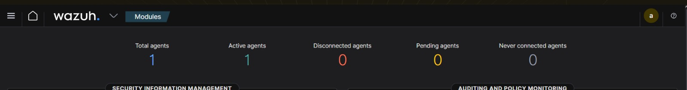
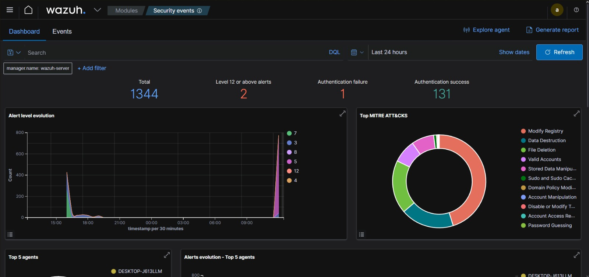
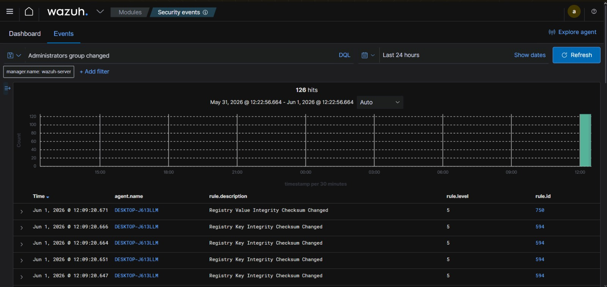
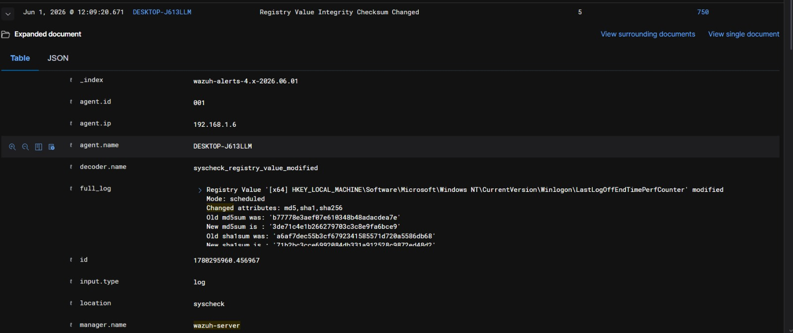

# SOC Home Lab – Wazuh File Integrity Monitoring (FIM)

## Project Overview

Built a Security Operations Center (SOC) home lab using Wazuh, Ubuntu Server, Windows Endpoint, and VirtualBox to monitor system activity, detect registry modifications, and perform File Integrity Monitoring (FIM).

The lab demonstrates how security teams can monitor Windows endpoints, investigate security alerts, analyze system changes, and detect suspicious activity using the Wazuh SIEM platform.

---

## Technologies Used

- Wazuh
- Ubuntu Server
- Windows 11
- Wazuh Agent
- VirtualBox
- File Integrity Monitoring (FIM)
- Windows Registry Monitoring
- Security Information and Event Management (SIEM)

---

## Lab Environment

- Ubuntu virtual machine hosting the Wazuh Server
- Windows 11 virtual machine configured as a monitored endpoint
- Wazuh Agent installed on Windows
- Centralized log collection and security monitoring through Wazuh Dashboard
- File Integrity Monitoring enabled for endpoint monitoring

---

## Project Objectives

- Deploy a Wazuh SIEM environment
- Configure Windows endpoint monitoring
- Enable File Integrity Monitoring (FIM)
- Monitor Windows registry changes
- Analyze security alerts
- Investigate endpoint activity
- Explore MITRE ATT&CK mapped detections

---

## Wazuh Dashboard Overview

The Wazuh dashboard provides centralized visibility into monitored endpoints, security events, and alert activity.

---

## Security Events Dashboard

The Security Events dashboard was used to investigate alerts, monitor endpoint activity, and analyze security-related events generated during testing.

---

## Administrators Group Change Detection

Wazuh detected privileged account and registry-related security events generated from the monitored Windows endpoint.

---

## Registry Integrity Monitoring

File Integrity Monitoring (FIM) detected modifications to monitored Windows registry values and generated detailed alerts containing change information, agent details, and event metadata.

---

## Skills Demonstrated

- Wazuh SIEM
- File Integrity Monitoring (FIM)
- Windows Endpoint Monitoring
- Registry Monitoring
- Security Event Analysis
- Threat Detection
- Log Analysis
- Security Operations Center (SOC)
- Incident Investigation
- Virtualization with VirtualBox
- Windows Security Monitoring

---

## Key Outcomes

- Successfully deployed a Wazuh-based SOC home lab.
- Connected and monitored a Windows endpoint using the Wazuh Agent.
- Investigated security alerts generated by endpoint activity.
- Monitored registry integrity changes using File Integrity Monitoring.
- Analyzed security events through the Wazuh Dashboard.
- Gained hands-on experience with SIEM operations and security monitoring workflows.

---

## Screenshots Included

1. Wazuh Dashboard Overview
2. Security Events Dashboard
3. Administrators Group Change Detection
4. Registry Integrity Monitoring Alert Details

---

## Project Outcome

This project demonstrates practical experience with Wazuh SIEM deployment, Windows endpoint monitoring, security event analysis, registry integrity monitoring, and incident investigation. It simulates real-world SOC analyst tasks involving alert investigation, endpoint visibility, and security monitoring.
